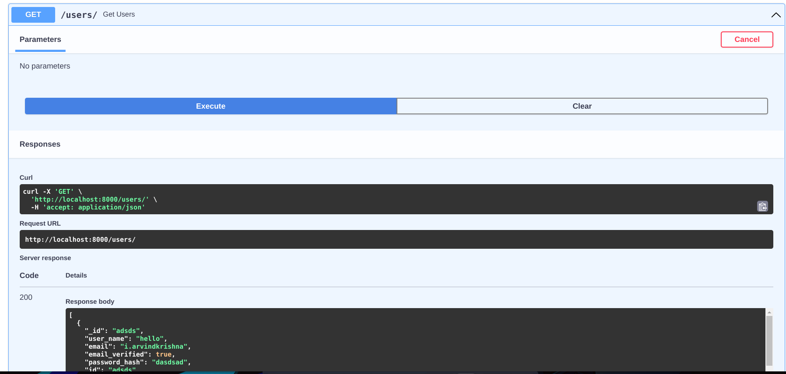

# Fast-API-hotel
REST API for Hotel data using FastAPI

## FastAPI
FastAPI is a modern, fast (high-performance), web framework for building APIs with Python 3.6+ based on standard Python type hints.
Learn more about it on the [official page](https://fastapi.tiangolo.com/) 

Database built on `MongoDB`, using `pydantic` classes as schema and data validation for the NoSQL DB.

### Usage

- Usual python stuff
- Create virtual env with `virtualenv venv`
- Activate the same with `source venv/bin/activate`
- Install dependencies with `pip3 install -r requirements.txt`
- Create a mongo cluster, or start a local mongodb server and set its url in `.env` in the format `DB_URL = "http://localhost:27017"`
- Start the server with the command `uvicorn API:app --reload` 
- The server will be running at [http://localhost:8000](http://localhost:8000)
- Visit `http://localhost:8000/docs` for the Swagger UI which helps in listing and instantly testing endpoints out

Swagger UI:

